<h1 style="display: flex; align-items: center;">
    
    <span>MTB-Coaching - Client End</span>
</h1>

Welcome to the client-side repository of the **_Professional Mountain Biking Coaching Network_** website. This platform is dedicated to connecting aspiring mountain bikers with professional instructors, offering a comprehensive range of courses and resources to enhance their skills.

<br>

<p align="center">
   
</p>

<br>

## 📚 Table of Contents
- [Packages & Technologies Used](#-packages--technologies-used)
- [Project Structure](#-project-structure)
- [Website Features](#-website-features)
- [Prerequisites](#-prerequisites)
- [Installation, Configuration & Running Locally](#-installation-configuration--running-locally)
- [Checkout Server End](#-checkout-the-server-end)
- [Live Deployment](#-live-deployment)
- [Contributing](#-contributing)
- [License](#-license)

<br>

## 🧰 Packages & Technologies Used

- **React**: Core library for building user interfaces
- **React Router**: For routing and navigation
- **React Router HashLink**: For smooth anchor navigation to sections within pages
- **Tailwind CSS**: Utility-first CSS framework
- **DaisyUI**: Tailwind CSS components
- **Axios**: For making HTTP requests
- **Firebase**: For authentication
- **Tanstack Query (React Query)**: For data fetching and state management
- **JWT**: For authentication
- **Environment Variables**: For configuration
- **Stripe**: For payment processing
- **SweetAlert2**: For beautiful alerts
- **React Hook Form**: For handling form validation
- **Emotion**: For styling components
- **Moment**: For date manipulation
- **Swiper**: For creating sliders
- **React Toastify**: For toast notifications
- **React Icons**: For icons
- **React Leaflet**: For interactive maps
- **React Simple Typewriter**: For typewriter effects
- **React Awesome Reveal**: For awesome animations
- **Vercel**: For seamless and fast deployment of the client-side application

<br>

## 📁 Project Structure

```
MTB-Coaching-Client/
├── src/                       
│   ├── activeLink/            # Custom active link navigation components
│   ├── api/                   # API utility functions for axios, auth and booking
│   ├── firebase/              # Firebase configuration
│   ├── Helmet/                # Custom React hooks for document title
│   ├── layout/                # Main layout and dashboard layout components
│   ├── pages/                 # All main page components (Home, Auth, Classes, etc.)
│   ├── privateRoute/          # Route protection: restricts access to authenticated (logged-in) users only
│   ├── providers/             # Context providers (e.g., AuthProvider)
│   ├── reusable/              # Reusable UI components (e.g., SectionTitle)
│   ├── roleRoute/             # Role-based protection: restricts access to users with specific roles (e.g., Student, Instructor)
│   ├── ScrollToTop/           # Scroll-to-top utility component
│   ├── shared_components/     # Shared UI components (Navbar, Footer, SideNav, etc.)
│   ├── index.css              # Global styles
│   ├── main.jsx               # App entry point
│   └── RouteTracker.jsx       # Remembers last allowed route for smart redirect after unauthorized access attempt
│
├── public/                    # Static assets (images, banners, icons, etc.)
├── documentation/             # Project screenshots and documentation images
├── .env.example               # Template Environment variables for local 
├── .eslintrc.cjs              # ESLint configuration
├── .gitignore                 # Git ignored files and folders
├── index.html                 # Main HTML file
├── LICENSE                    # Project license information (MIT)
├── package-lock.json          # Auto-generated lockfile for npm dependencies
├── package.json               # Project metadata and dependencies
├── postcss.config.js          # PostCSS configuration
├── README.md                  # Project documentation (this file)
├── tailwind.config.js         # Tailwind CSS configuration
├── vercel.json                # Vercel rewrite config for SPA routing
└── vite.config.js             # Vite build tool configuration
```

<br>

## 🚀 Website Features

<details>
<summary>
   <span style="font-size:1.05em; font-weight:bold;">
      Click to expand and see all the features in detail. Below is a summary of the platform's main highlights.
   </span>
</summary>
</summary>

<br>

- ***Dynamic Home Page:*** Includes a slider, typewriter animation, popular instructors/courses, and embedded YouTube bike hack videos.
   <p align="center">
      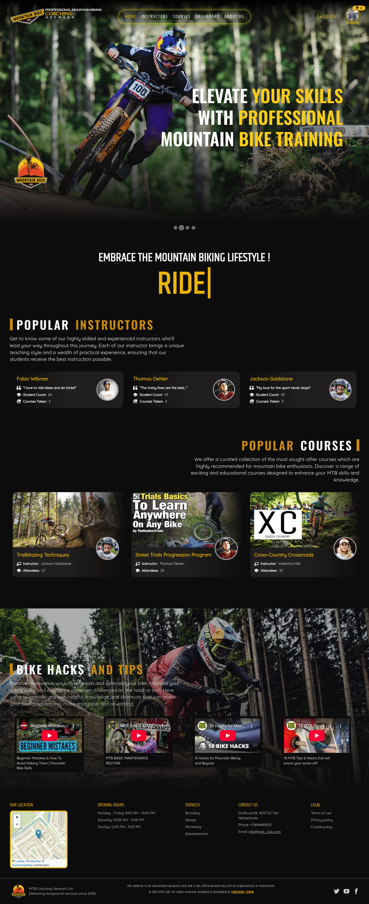
   </p>

<br>

- ***Footer:*** A meaningful footer is present on all pages except dashboard, including a mini map, ensuring consistency and providing essential links or information.
   <p align="center">
      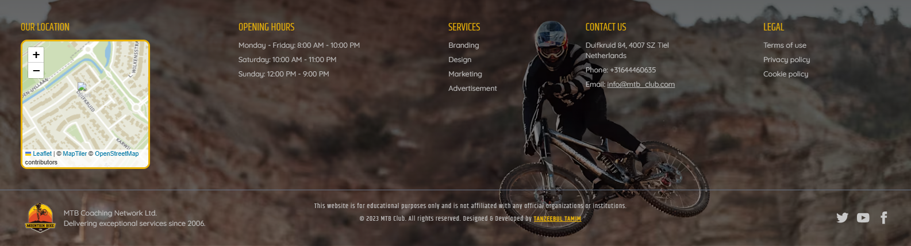
   </p>

<br>

- ***Responsive Design:*** The entire website is built to be mobile-friendly and adapts seamlessly to smartphones.
   <p align="center">
      
   </p>

<br>

- ***Authentication:*** Users can register as instructors or students and log in using their registered email and password or social accounts.
   - ***Register:***
      - ***As Student:***
         <p align="center">
            
         </p>

      - ***As Instructor:***
         <p align="center">
            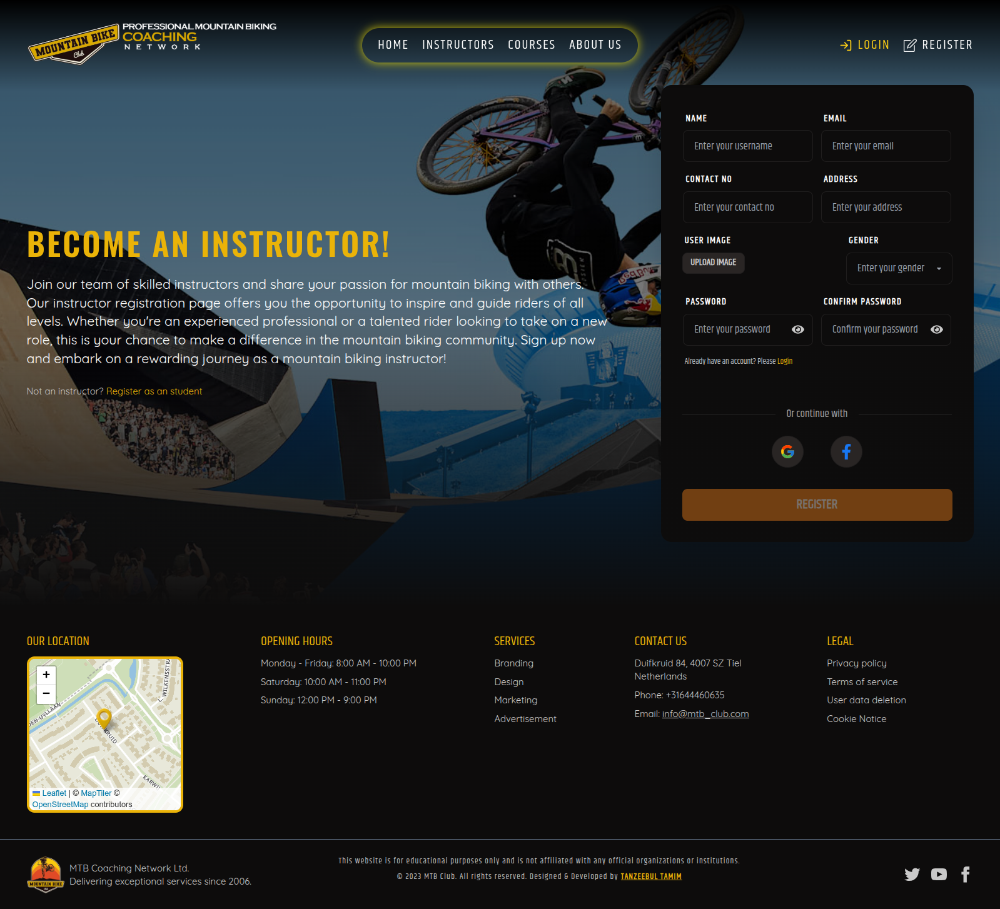
         </p>

      - Both students and instructors can register by providing their name, email, contact number, address, gender, password, and a profile image.
      - Passwords must meet security requirements (minimum length, uppercase, digit, special character).
      - After registration, a verification email is sent to activate the account.

  <br>

  - ***Email Verification:***
      <p align="center">
         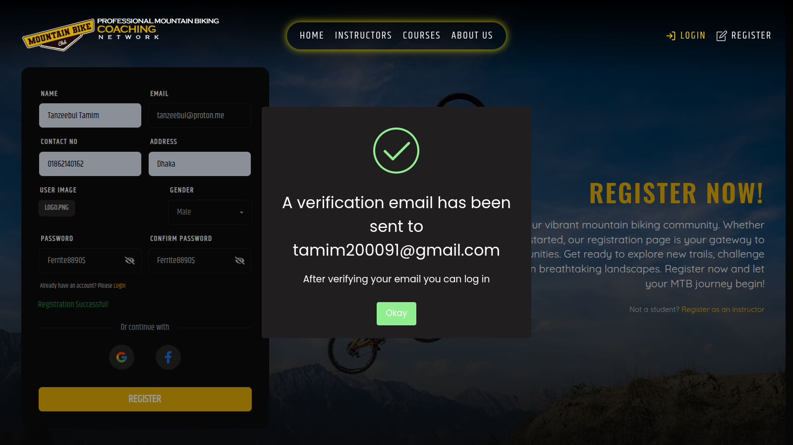
      </p>
      <p align="center">
         
      </p>

      - After registration, a verification email is sent to the user's email address.
      - Users must verify their email before they can log in.
      - If a user tries to log in without verifying their email, they will be prompted to verify first and logged out automatically.
      - A success message is shown after registration, instructing users to check their email for the verification link.

    <br>

   - ***Login:***
      <p align="center">
         
      </p>

      - Captcha validation is required for login to enhance security.
      - Social login options ***(Google and Facebook)*** are also available for quick access.
      - Only users with verified emails can log in.

  <br>

  - ***Password Reset:***
      - ***Forgot Password:***
         <p align="center">
            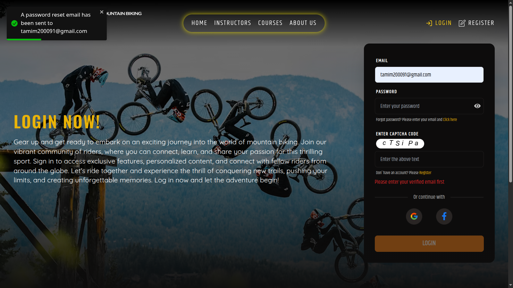
         </p>
         <p align="center">
            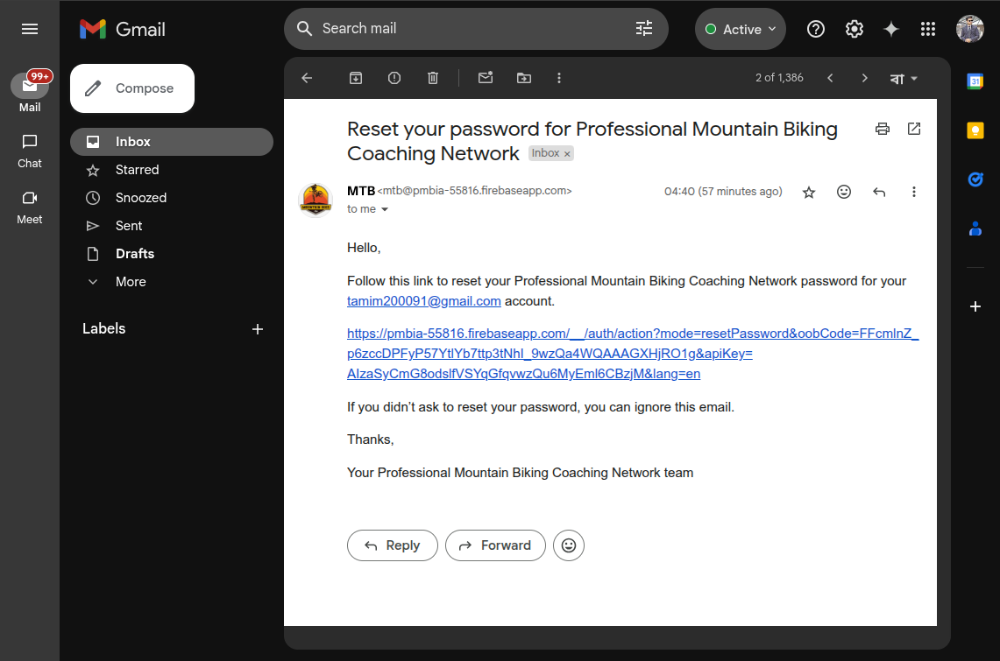
         </p>

         - Users can reset their password by clicking ***`Forgot password?`*** and entering their registered email.
         - A password reset email is sent to the user's registered email address which allows users to set a new password securely.

         <br>
      
      - ***Change Password:***
         <p align="center">
            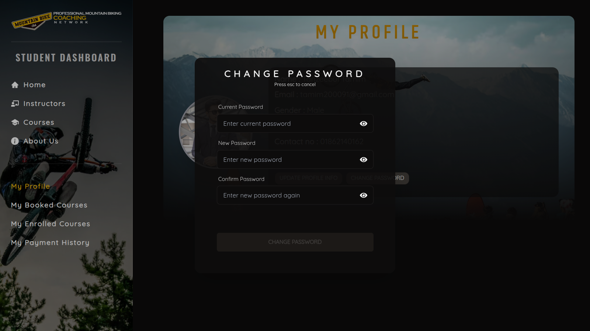
         </p>     
         
         - Users can also update their password directly from their user dashboard after logging in.
      
   <br>

   - ***Social Authentication:***
      - ***Login with Google Account:***
         <p align="center">
            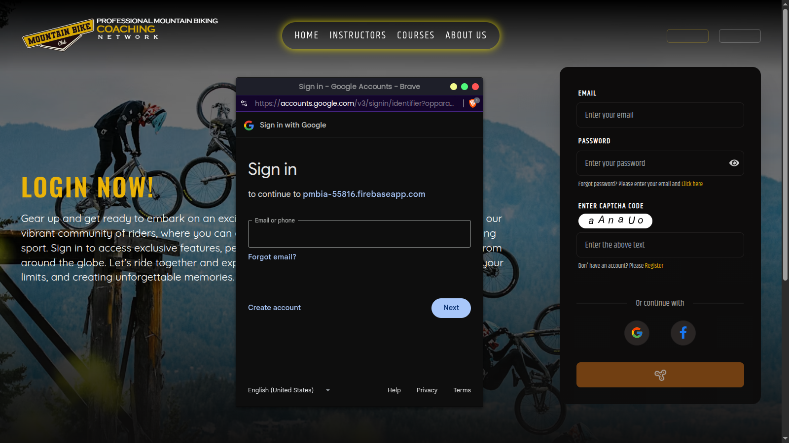
         </p>

      - ***Login with Facebook Account:***
         <p align="center">
            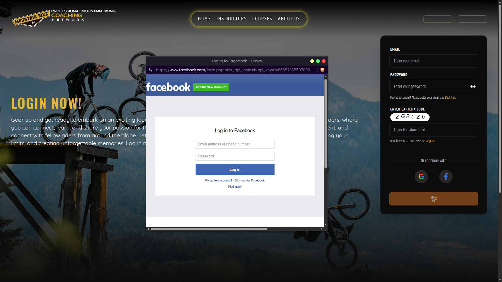
         </p>

         > **⚠️ Note:** <br>
         > Facebook login may not return your email or profile picture due to Facebook API limitations, especially because the app is not published since it's a practice project (business verification required). This is a Facebook/Meta restriction, not a bug in this app.
   
   <br>

   - ***Access Control:***
      - ***Private Routes:*** Dashboard and instructors' walls are protected and only accessible to authenticated users (requires signing in). Unauthenticated users are automatically redirected to the login page.

      <p align="center">
         
      </p>     
         
      <br>

      - ***Role-Based Routes:*** Some routes are further restricted based on user roles (e.g., only instructors can access course creation pages, only students can access payment pages). Unauthorized users are redirected and shown an appropriate message.

      <p align="center">
         
      </p>     

<br>

- ***Instructors Page:*** Users can search for instructors, view their name, email, and the number of courses they have taken. Users can also visit the instructors' individual walls for more detailed information.
  <p align="center">
     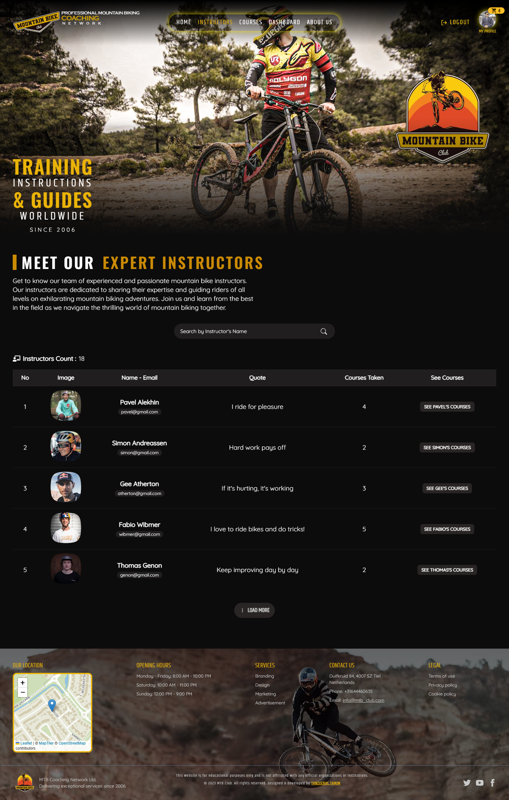
  </p>

<br>

- ***Instructor's Wall:*** Separate dedicated page for each instructor to showcase all the courses offered by them.
   <p align="center">
   
   </p>

<br>
  
- ***Courses Page:*** Users can search for courses, check seat status, view price details, see the instructor's name, and the course name. The page also allows users to book courses directly.
  <p align="center">
     
  </p>

<br>

- ***Interactive Dashboard:*** Separate dashboards for students and instructors.
   <br>

  - ***Student Dashboard:*** 

    - ***User  Profile:*** View and update personal information, including password change.
      <p align="center">
         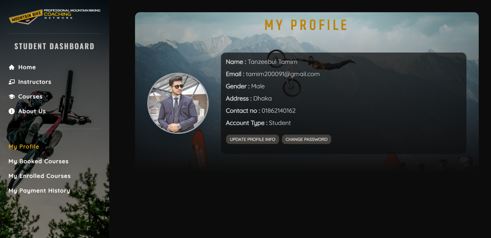
      </p>
      <p align="center">
         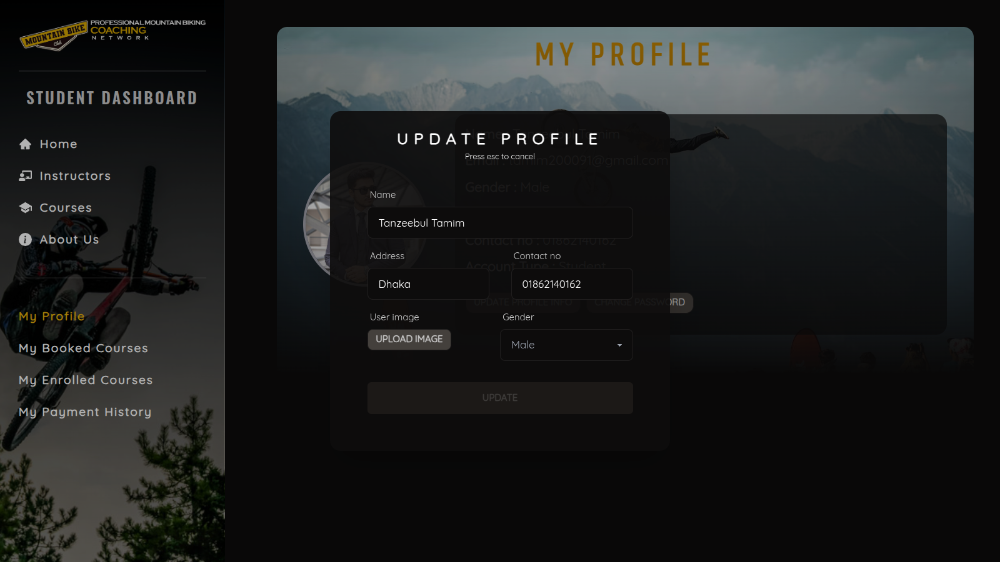
      </p>

      <br>

    - ***Booked Courses:*** Shows unpaid courses with basic details and cancellation options.
      <p align="center">
         
      </p>

      <br>

    - ***Enrolled Courses:*** Displays all paid and enrolled courses.
      <p align="center">
         
      </p>

      <br>

    - ***Payment Methods:*** Allows students to make secure payments via Stripe.
      <p align="center">
         
      </p>

      <br>

    - ***Payment History:*** Track transaction details, including status and timestamps.
      <p align="center">
         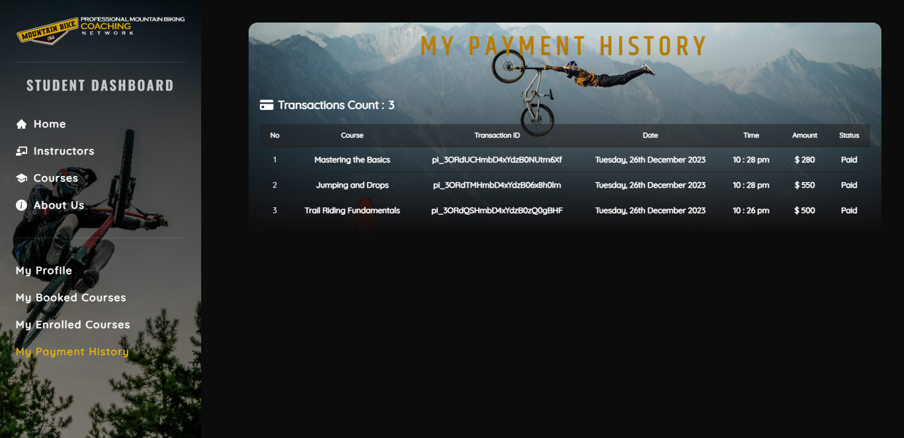
      </p>

   <br>

   - ***Instructor Dashboard:***

      - ***User  Profile:*** View and update personal information, including password change.
         <p align="center">
            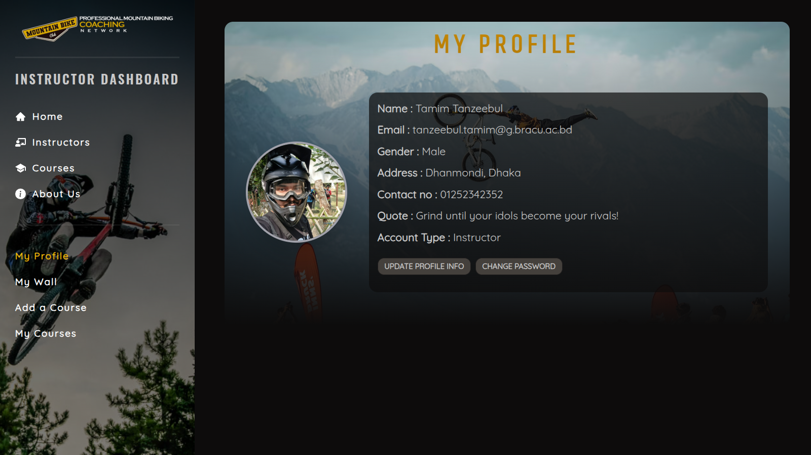
         </p>
         <p align="center">
            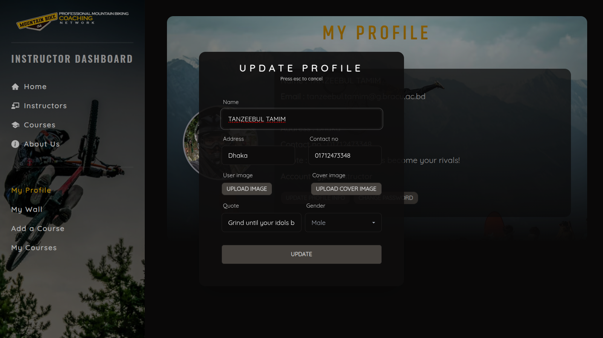
         </p>

      <br>

      - ***My Wall (Instructor's public profile):***
         <p align="center">
            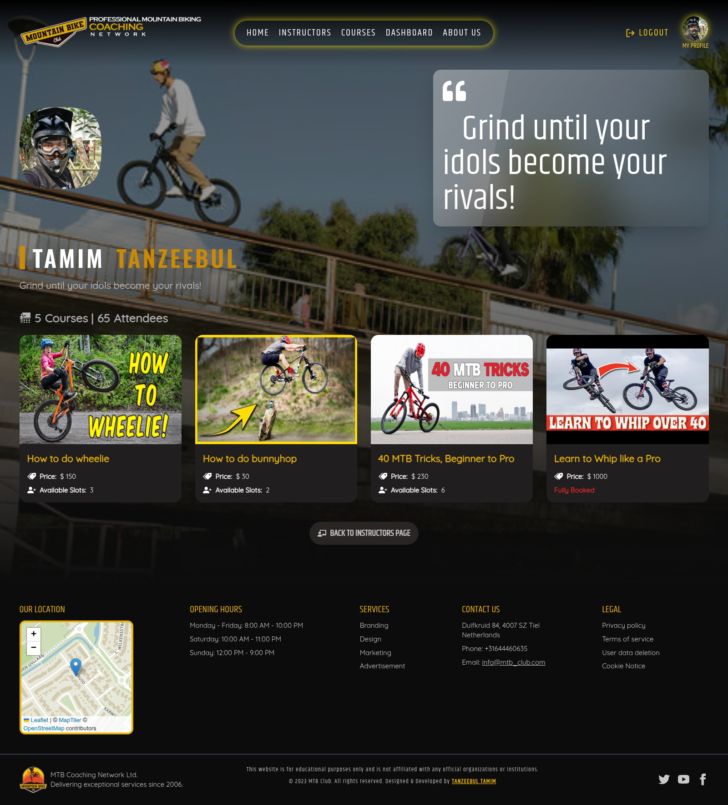
         </p>

         - Instructors can access their own public profile page directly from their dashboard.
         - The instructor's wall cover image can be updated from the profile page in the dashboard.
         - Notice that instructors don't have a "Book Course" button on their own wall, unlike what students see on instructor profiles.

      <br>

      - ***Add a Course:*** A detailed form to create and publish new courses.
         <p align="center">
            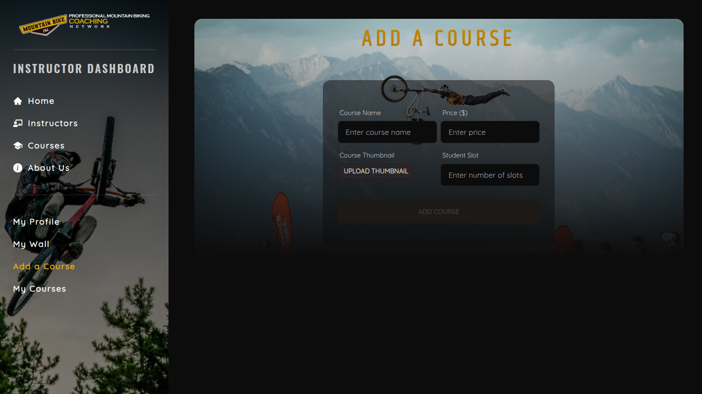
         </p>

      <br>

      - ***My Offered Courses:*** Lists all courses created by the instructor.
         <p align="center">
            
         </p>   

      <br>

      - ***My Students:*** View and search all students enrolled in a specific course offered by the instructor.
         <p align="center">
            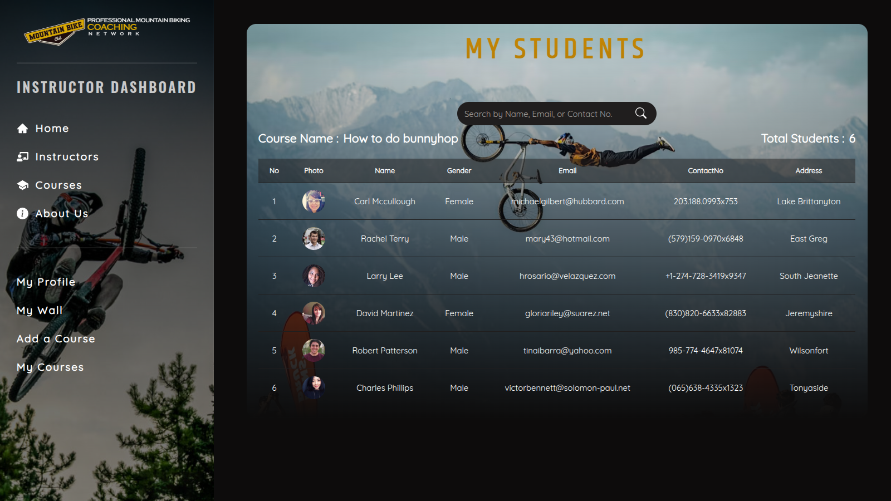
         </p>   

         Instantly filter students using the integrated search feature by: 
         - Name
         - Email
         - Contact number

<br>

- ***Email System:*** This site supports transactional email notifications (such as enrollment confirmations and payment receipts) for users. This feature is implemented on the server side.

   <p align="center">
      
   </p>
   
   For details, see the [**_Email System_ section in the server documentation**](https://github.com/Tanzeebul-Tamim/MTB-Coaching-Server#-email-system).

<br>

- ***404 Page:*** A custom 404 page is created with an added GIF, enhancing the user experience in case of page not found errors.
   <p align="center">
      
   </p>

<br>

- ***About Us Page:*** This page provides information about the website's purpose and other relevant details, helping users understand the mission and vision of the platform.
  <p align="center">
     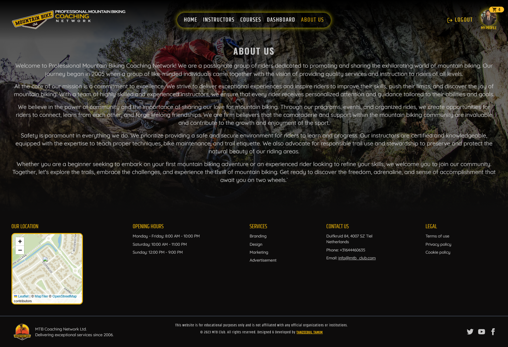
  </p>

<br>

- ***Legal Information Page:*** This page presents all legal information in a visually appealing, organized, and accessible format. Each section is directly accessible via anchor links from the site footer for user convenience.
   <p align="center">
     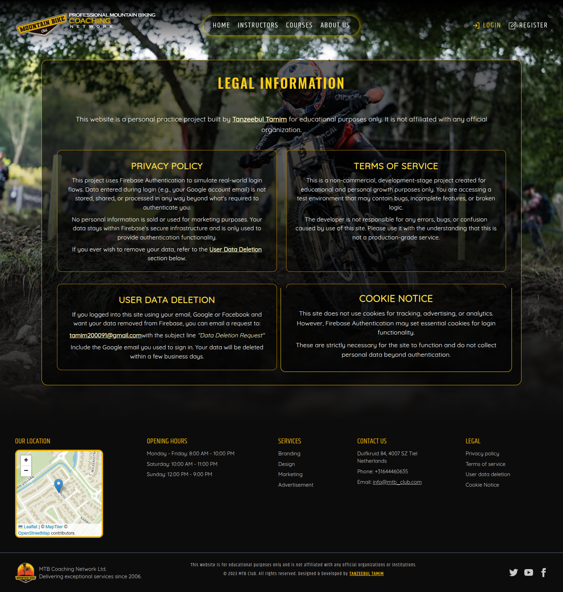
   </p>


   - **Privacy Policy:** Clear explanation of how user data (e.g., Google login) is handled and protected. No tracking or data sharing involved.
   - **Terms of Service:** Describes the non-commercial, educational nature of the project and usage limitations.
   - **User Data Deletion:** Provides a simple manual process to request data removal via email.
   - **Cookie Notice:** Discloses use of essential cookies for authentication only — no analytics or tracking.

</details>

<br>

## ✅ Prerequisites

- [**Node.js**](https://nodejs.org/) (v18 or higher recommended)
- [**npm**](https://www.npmjs.com/) (comes with Node.js) (running locally or accessible remotely)
- A [`.env`](./.env.example) file with required environment variables  
  _(See the detailed guide in the [Installation, Configuration & Running Locally](#-installation-configuration--running-locally) section below)_

<br>

## 🔧 Installation, Configuration & Running Locally

1. **_Clone the repository:_**
   ```sh
   git clone https://github.com/Tanzeebul-Tamim/MTB-Coaching-Client
   cd MTB-Coaching-Client
   ```

2. **_Install dependencies:_**
   ```sh
   npm install
   ```

3. **_Set up Environment Variables:_**

    - **Rename the `.env.example` file in the project root to `.env`:**

        All the following values can be found in the [`.env.example`](./.env.example) file:

        ```env
        VITE_APIKEY=firebase_api_key
        VITE_AUTHDOMAIN=firebase_auth_domain
        VITE_PROJECTID=firebase_project_id
        VITE_STORAGEBUCKET=firebase_storage_bucket
        VITE_MESSAGINGSENDERID=firebase_messaging_sender_id
        VITE_APPID=firebase_app_id
        VITE_API_URL=backend_api_url
        VITE_IMGBB_API_URL=imgbb_api_url
        VITE_IMGBB_KEY=imgbb_api_key
        VITE_PAYMENT_GATEWAY_PK=stripe_public_key
        ```

    - **Guide & Configuration Details**

        - **Firebase Configuration:**
            - **`VITE_APIKEY`**: Firebase project's API key
            - **`VITE_AUTHDOMAIN`**: Firebase project's authentication domain
            - **`VITE_PROJECTID`**: Firebase project ID
            - **`VITE_STORAGEBUCKET`**: Firebase project's storage bucket
            - **`VITE_MESSAGINGSENDERID`**: Firebase messaging sender ID
            - **`VITE_APPID`**: Firebase app ID
            <br>        

        - **imgbb Configuration:**
            
            - **`VITE_IMGBB_API_URL`**: The base URL for [**_imgbb_**](https://imgbb.com/) API for image uploads.
            - **`VITE_IMGBB_KEY`**: [**_imgbb_**](https://imgbb.com/) API key for image uploads.
            <br>

         - **Backend API URL:**
            **`VITE_API_URL`**: The base URL for backend API (hosted server for this website).
            For more details about the server, see the [**server GitHub repository**](https://github.com/Tanzeebul-Tamim/MTB-Coaching-Server).
            
            <br>

        - **STRIPE PUBLIC KEY:**            
            **`VITE_PAYMENT_GATEWAY_PK`**: [**_Stripe_**](https://stripe.com/) public key for payment processing.
            <br>

        > ⚠️ **Important Notes:** <br>
        > - Public keys (_Firebase_, _Stripe_, _imgbb_, etc.) are safe to expose. They’re required for client-side setup and do not pose security risks.
        > - Never commit your actual `.env` file. This file may contain sensitive info and should always be listed in `.gitignore`.


4. **_Running the Project_**

   ```sh
      npm run dev
   ```

<br>

## 💻 Checkout the Server End
Visit the [**_server-end repository_**](https://github.com/Tanzeebul-Tamim/MTB-Coaching-Server) of the website.

<br>

## 🌐 Live Deployment

The site is deployed on [**Vercel**](https://vercel.com/) and is live at [***this following URL***](https://mtbcoachingnetwork.vercel.app/).

<br>

## 🤝 Contributing

Have ideas to improve this platform? Found a bug?
Let’s make it better together! [Open an issue](https://github.com/Tanzeebul-Tamim/MTB-Coaching-Client/issues) or submit a pull request.

<br>

## 📄 License
This project is licensed under the **MIT License** - see the [**_LICENSE_**](LICENSE) file for details.
